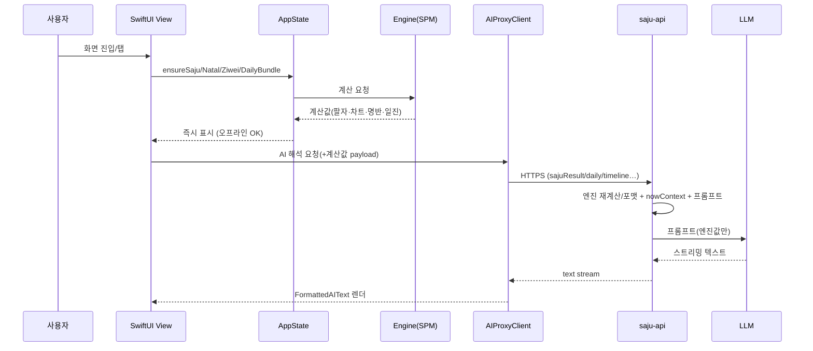

# 달토끼(DalTokkie) 전체 아키텍처

> 운세/사주/타로 iOS 앱의 앱·엔진·서버 구조, 엔진 내부 로직, 콘텐츠별 데이터 흐름, 다이어그램을 한 문서로 정리.
> 작성: 2026-06-28. 관련: `docs/WORKLOG.md`, `docs/DECISIONS.md`.

---

## 0. 핵심 원칙 (가장 중요)

> **모든 운세 "계산"은 앱 안(온디바이스 엔진)에서 수행한다. 서버(saju-api)는 그 계산값을 받아 LLM으로 "글(해석)"만 쓰는 프록시다.**

- 사주팔자·천체력·자미명반·일일운세·궁합 = **앱 내 Swift 엔진**(오프라인, 골든 검증).
- AI 해석/편지/세부 콘텐츠 = **서버가 LLM 호출**. LLM은 앱이 보낸(또는 서버가 동일 엔진으로 재계산한) **계산값만 해석** — 명리/천체/자미 사실을 지어내지 않음.
- 서버 주소 `daltokkie.vercel.app` 이 앱의 **유일한** 네트워크 의존(`AIProxyClient.baseURL`).

```
┌────────────────────────────── iPhone (오프라인 동작) ──────────────────────────────┐
│  SwiftUI Views ──▶ AppState(상태·캐시 허브) ──▶ Engine SPM (SajuKit/NatalKit/      │
│       │                    │                      ZiweiKit/LunarKit)  = 계산        │
│       │                    └─ AIProxyClient ──┐                                     │
└───────┼──────────────────────────────────────┼─────────────────────────────────────┘
        │ 화면 즉시 표시(계산값)                 │ HTTPS 스트리밍 (계산값 payload)
        ▼                                       ▼
   사용자                          ┌──── saju-api (Vercel / Next.js) ────┐
                                   │  /api/.../interpret, content/[id]   │
                                   │  엔진(TS 포팅) → 포맷터 → 프롬프트  │
                                   │             → LLM(gpt-4o-mini)      │
                                   └─────────────────────────────────────┘
```

---

## 1. 저장소 2개

| 저장소 | 경로 | 역할 | 배포 |
|---|---|---|---|
| **daltokkie-ios** | `~/dev/daltokkie-ios` | iOS 앱(SwiftUI) + 온디바이스 엔진(SPM) | App Store |
| **saju-api** | `~/dev/saju-api` | Next.js 서버 — AI 해석 라우트 + 동일 엔진 TS 포팅(웹앱 겸용) | `vercel --prod` |

> 두 저장소의 엔진은 **골든 픽스처로 비트 단위 동일성 검증**(DEC-031, 서버 테스트 236건). 일일운세 점수만 의도적 분기(DEC-014).

---

## 2. iOS 앱 레이어 (`App/`)

### 2.1 진입·상태·통신 (코어 4)

| 파일 | 역할 | 사용처 |
|---|---|---|
| `DalTokkieApp.swift` | 진입점. `RootView`가 프로필 유무로 **온보딩 ↔ 메인탭** 분기. 폰트(`DTFonts`)·TipKit 초기화 | 최상위 |
| `AppState.swift` | **@Observable 상태 + 엔진 호출 허브.** 프로필 보관, 엔진 결과 캐시, AI용 JSON 빌더, 홈 AI 캐시 | 모든 View `@EnvironmentObject` |
| `AIProxyClient.swift` | **서버 통신 전담.** 메서드→path 매핑, payload 직렬화, 스트리밍 파싱 | AI 쓰는 모든 View |
| `Models/UserProfile.swift` | 생년월일시·성별·음양력·윤달·진태양시·지역 (UserDefaults 영구) | AppState |

**AppState 주요 멤버**
- 캐시 진입점: `ensureSaju()`·`ensureNatal()`·`ensureZiwei()`·`ensureDailyBundle()` (프로필 변경 시 `invalidate()`).
- 입력 정규화: `solarBirth()`(음→양 변환, 점성/자미 입력), `solarBirthYMD()`(공개).
- AI 데이터 빌더: `sajuTimelineJSON()`(대운/세운/월운), `todayDailyPayload()`(오늘 일진+합충+신살+점수), `commonContext`(연도·나이·지역).
- 홈 히어로: `ensureHeroLines()`(주간 7일 AI 한 줄 → `UserDefaults` 날짜별 캐시, 하루 1호출), `heroLines[date]`.

**AIProxyClient 메서드 → 서버 라우트**

| 메서드 | path | 용도 |
|---|---|---|
| `interpretSaju` | `/api/saju/interpret` | 사주 심층 편지 |
| `content(id:)` | `/api/saju/content/{id}` | **세부해석 ~48종**(자동 라우팅) |
| `interpretNatal` | `/api/natal/interpret` | 점성 해석 |
| `interpretZiwei` | `/api/ziwei/interpret` | 자미 해석 |
| `interpretTarot` | `/api/tarot/interpret` | 타로 리딩 |
| `interpretDaily` | `/api/daily/interpret` | 달빛 편지(`style: letter`/`oneline`) |

직렬화: `sajuResultJSON`/`pillarJSON`(팔자), payload에 `timeline`·`daily`·`isLunar/isLeapMonth/useTrueSolarTime` 동봉(서버 정확 재계산용).

### 2.2 화면(View) 레이어

| 화면 | 파일 | 내용 (엔진/AI) |
|---|---|---|
| 탭바 | `MainTabView.swift` | 홈·부적함·운세·타로·마이 (중앙 배지 오버레이) |
| **홈** | `Home/HomeView.swift` | 달빛 편지 히어로, 행운 아이템, 운세 컨디션, 자세히 보기(오늘의 운세), 달력 버튼→풀스크린 |
| ↳ | `Home/MoonLetter.swift` | 점수·영역 한 줄 요약(규칙 폴백) |
| ↳ | `Home/HomeConditions.swift`·`LuckyItemReason.swift` | 컨디션·행운 아이템 사유 |
| 운세 메뉴 | `Fortune/FortuneMenuView.swift` | 사주·점성·자미·궁합 진입 |
| **사주 상세** | `Fortune/SajuDetailView.swift` | 히어로·명식표·분석섹션·AI |
| ↳ | `Fortune/SajuAnalysisSections.swift` | 오행분포·신살길성표·관계·세운·운세달력(`FortuneCalendarView`·`MonthlyFortuneCalendar`) |
| **점성·자미** | `Fortune/NatalZiweiViews.swift` | 차트·명반·AI |
| ↳ | `Fortune/NatalDialChart.swift`·`ZiweiGridChart.swift` | Canvas 도식(온디바이스 렌더) |
| 궁합 | `Fortune/CompatibilityView.swift` | 두 사주 **온디바이스 점수**(서버 불필요) |
| AI 표시 | `Fortune/AIInterpretationView.swift` | 스트리밍 시트·`FormattedAIText`·`AISkeleton` |
| ↳ | `Fortune/AIContentPanel.swift`·`AIContentSections.swift` | 세부해석 메뉴(톤 + 목록) |
| 타로 | `Tarot/TarotView.swift`·`TarotData.swift` | 78장·스프레드·3D 플립·AI |
| 부적·마이 | `Misc/TalismanMyViews.swift` | 부적함·내 정보·지역 설정 |
| 온보딩 | `OnboardingView.swift` | 생년월일시 입력 |
| 공통 | `Theme.swift`·`Charts/FortuneCharts.swift` | DT 토큰·`CraftCard`·`dtDyn`(다크)·차트 |

---

## 3. 온디바이스 엔진 + 내부 로직 (`Engine/Sources/`, SPM 4패키지)

순수 Swift, UI 의존 0. 각 엔진은 saju-api의 TS 엔진을 비트 동일 포팅.

### 3.1 LunarKit — 음↔양력 변환
- `LegacyLunarConverter`: **사주용**(ft-lib 비트팩 테이블). `lunarToSolar()`.
- `LunarConverter` + `LunarTable`: **자미용**(lunar-javascript 호환 테이블).
- 왜 둘? 두 라이브러리 테이블이 미세하게 달라 각 엔진의 원본과 맞춤(라운드트립 220케이스 검증).

### 3.2 SajuKit — 사주팔자
**`SajuCalculator.calculate()` 파이프라인** (`SajuCalculator.swift`):
```
입력(벽시계 y/m/d/h/m, 음양력)
 → ① 음력이면 LegacyLunarConverter로 양력 변환
 → ② KDT(한국 서머타임 1948-51/87-88) 보정: 항상 -60/0분
 → ③ 진태양시(옵션): deltaMin = -tzOffset + 경도×4 + 균시차(EoT) + 2
 → ④ SajuCore(hoshin 반시법, 내부 -32분) → 4기둥(년월일시 간지)
 → ⑤ 한글/한자/오행/음양 매핑 → FortuneTellerResult(_raw 포함)
```
**`EngineAnalysis`(분석 함수 모음)** — 일간 기준 파생:
- `calculateTenGods`(십성), `calculateTwelveStages`(12운성), `calculateHiddenStems`(지장간),
- `calculateBranchRelations`(합충형파해)·`calculateMultiRelations`(삼합/방합)·`calculateStemRelations`(천간합충),
- `calculateGongMang`(공망), `calculateTwelveSpirits`(12신살)·`calculateSpecialSals`(특수살),
- `buildStrengthFromLibrary`(신강신약)·`buildYongsinFromLibrary`(용신/희신/기신), `HoshinGyeokGuk`(격국),
- `calculateYearFortune`(세운)·`calculateMonthlyPillars`(월운), `HoshinDaeUn.calculateDaeUn`(대운: 절기 기준 순/역행).

**`DailyFortune`(일일운세)** — *DEC-014: 앱 자체 진화 알고리즘*:
```
그날 일진(전치) 간지 → 원국과 합충형파해 검출(findTransitRelations)
 → 십성×카테고리 보정표 + relationModifier(합+/충형파해−, 일주 1.5배, ±18 클램프)
 → seeded PRNG(같은 사람·날짜=같은 결과) → 영역별 점수 → scoreToGrade(상/중상/중/중하/하)
 → narrativePhrases 조합 → 요약문
```
`DailyFortuneService.build()` = 오늘±3(7일) 번들. `calculateMonthlyCalendar()` = 한 달 일별 간지·점수.

### 3.3 NatalKit — 서양 천체력 (AGPL-free 자체 구현)
**`Ephemeris`/`CleanBodies` 천체 위치 파이프라인**:
```
VSOP87B(J2000 일심 구면) → 직교 → 지심 변환 → 황도 세차(J2000→of date)
 → 장동(nutation) → 외관 황경/황위/거리 + 속도(deg/day)   (명왕성은 별도 해석해)
```
**`NatalEngine.calculateNatal()`**:
```
입력(생년월일시·위경도·타임존) → resolveToUtc(DST gap 에러/중복은 표준시)
 → JD → 행성 황경(of date) → 별자리/도수
 → Houses(whole-sign 'W' 또는 Placidus 'P') 커스프 → findHouse(행성→하우스)
 → calculateAspects(각도차 0/60/90/120/180 ± 오브)
 → trueNode 옵션: osculatingNodeLongitude(h=r×v 각운동량)
```
> 트랜짓 = `calculateNatal(오늘 날짜)` → 그 시점 행성 위치(서버가 점성 트랜짓 콘텐츠에 사용).

### 3.4 ZiweiKit — 자미두수
**`ZiweiEngine` 명반 구성**:
```
양력 입력 → LunarConverter로 음력(년간지/월/일/시) →
 ① 명궁/신궁(월·시 기준) → ② 오행국(궁간지) →
 ③ 자미성 위치(lunarDay/juNumber) → 14주성 + 보조성 안성(배치) →
 ④ 생년사화(년간→화록/권/과/기) → 12궁 성요 →
 ⑤ 대한(10년)·유년(該年)·유월(월) 운
```

---

## 4. 서버 (`saju-api/`)

### 4.1 API 라우트 (`app/api/`)

| 라우트 | 역할 |
|---|---|
| `saju/interpret`·`daily/interpret`·`natal/interpret`·`ziwei/interpret`·`tarot/interpret` | 엔진별 AI 해석 스트리밍 |
| **`saju/content/[id]`** | **세부해석 허브** — `id` 접두사로 분기 |
| `saju/compatibility`·`compatibility-interpret` | 궁합 점수·해석 |
| `saju/{analyze,full-analysis,daily-fortune,reference}`·`natal/chart`·`ziwei/chart` | (웹앱용) 계산 엔드포인트 |
| `health` | 헬스체크 |

**`content/[id]` 카테고리 분기** (`getEngineCategory`):
```
MULTI(cross-report·yearly-cross·life-graph) │ ziwei-* │ natal-* │ 그 외 = saju
```

### 4.2 서버 엔진 (`lib/{saju,natal,ziwei}/`) — 앱 엔진 TS 포팅
- `saju/fortuneteller.ts`: `ftCalculateSaju`(음력·진태양시 정확), `ftCheckCompatibility`(궁합 점수).
- `saju/saju-engine.ts`: `ftFullAnalysis`(십성·용신·격국·신살·대운 전체·세운·월운·**월간달력** 일괄), `calculateMonthlyCalendar`.
- `natal/natal-engine.ts`: `calculateNatal`(임의 날짜=트랜짓).
- `ziwei/ziwei-engine.ts`: `createChart`·`calculateLiunian`·`getDaxianList`.

### 4.3 AI 레이어 (`lib/ai/`) — 엔진값 → 글
**조립 흐름**: `engineData(포맷터) + nowContext(시점/일진) + tonePrompt + contentPrompt → LLM`

| 단계 | 파일 | 내용 |
|---|---|---|
| 포맷터 | `format-{saju,natal,ziwei}-for-ai.ts`, `format-cross-engine.ts` | 엔진값 → LLM용 마크다운(십성표·행성표·명반·생년사화·트랜짓·월간달력) |
| 시점 | `now-context.ts` | `buildNowContext`(연도·나이)·`buildDailyJinContext`(오늘 일진) — 환각 방지 |
| 프롬프트 | `prompts/content/*.ts`(48), `prompts/{base,tone-mz,tone-warm,tone-classic}.ts`, `prompts/index.ts`(`buildContentPrompt`) | 콘텐츠별 형식 + 톤 |

---

## 5. 콘텐츠 카탈로그 (세부해석 ~48종)

| 카테고리 | 데이터 출처 | 콘텐츠(예) |
|---|---|---|
| **사주(~25)** | 서버 `ftCalculateSaju`+`ftFullAnalysis` 재계산 + 앱 `daily`/`timeline` | daily-one-liner, daily-fortune, do-dont, focus-now, lucky-day, fortune-calendar, full-analysis, life-mission, talent-discovery, career-aptitude, destiny-card, balance-gauge, monthly-fortune/energy/detailed, yearly-fortune, current-worry, next-turning-point, age-guide, life-roadmap, love-fortune, timing-money/love/career, compatibility |
| **점성(10)** | 앱 `natalChart` + (트랜짓 콘텐츠) 서버 `calculateNatal(오늘)` | natal-sun-moon, natal-rising, natal-houses, natal-aspects, natal-element-balance, natal-career, natal-love, natal-full-analysis, natal-transit, natal-monthly |
| **자미(10)** | 서버 `createChart`(양력 변환 입력)+liunian/daxian | ziwei-full-analysis, ziwei-palace-analysis, ziwei-destiny-pattern, ziwei-sihua, ziwei-career, ziwei-love, ziwei-health, ziwei-daxian, ziwei-liunian, ziwei-monthly |
| **멀티(3)** | 세 엔진 `formatCrossEngineForAI` | cross-report, yearly-cross, life-graph |

> 정확도 감사(WORKLOG #60·61)로 모든 시점·해석 콘텐츠가 **엔진 계산값 기반**으로 전환됨.

---

## 6. 콘텐츠별 데이터 흐름 (다이어그램)

### 6.1 홈 진입 (달빛 편지 + 오늘의 운세)
```
HomeView 진입
 ├─ AppState.ensureDailyBundle()
 │     └─ SajuKit DailyFortuneEngine (온디바이스: 오늘 일진·점수·합충·신살)
 │     └─ 화면 즉시 표시: 점수·컨디션·달빛편지(MoonLetters.summary 규칙 폴백)
 └─ .task → AppState.ensureHeroLines()  (주간 7일)
        └─ 캐시 hit? → 즉시 표시
        └─ miss → AIProxy.interpretDaily(style:"oneline", daily: todayDailyPayload())
                → 서버 /api/daily/interpret
                   → buildDailyJinContext(정확한 일진) + oneline 프롬프트
                   → LLM 3줄 → UserDefaults 날짜별 캐시
"자세히 보기" 탭 → AIProxy.content("daily-fortune", daily, isLunar…)
```

### 6.2 사주 세부해석 (예: timing-money) — 서버 재계산 경로
```
SajuDetailView → AIContentPanel("timing-money") 탭
 → AIProxy.content(id, sajuResult, isLunar, isLeapMonth, useTrueSolarTime, daily, timeline)
 → 서버 saju/content/[id]  (category=saju)
     ├─ ftCalculateSaju(음력 정확)             ┐ 서버 정통 재계산
     ├─ ftFullAnalysis → 십성·용신·대운·세운·월간달력 ┘ (LLM 추측 제거)
     ├─ formatSajuForAI(analysis)  +  nowContext(일진·타임라인)
     ├─ buildContentPrompt(timing-money 형식 + 톤)
     └─ LLM 스트리밍 → 앱 FormattedAIText 렌더
```

### 6.3 점성 트랜짓 (natal-transit)
```
NatalZiweiViews → content("natal-transit", natalChart)
 → 서버 saju/content/[id] (category=natal)
     ├─ natal = 앱 natalChart(출생)
     ├─ transit = calculateNatal(오늘)   ← 실제 현재 행성 위치(환각 방지)
     ├─ formatNatalForAI(natal, transit)
     └─ LLM("제공된 트랜짓만 사용") → 렌더
```

### 6.4 자미 (ziwei-sihua)
```
NatalZiweiViews → content("ziwei-sihua", 양력 변환 birth, isLunar:false)
 → 서버 (category=ziwei)
     ├─ createChart(양력) → 명반 + 생년사화(per-star siHua)
     ├─ formatZiweiForAI → 생년사화 요약 섹션
     └─ LLM → 렌더
```

### 6.5 궁합 (서버 LLM 불요 / 선택적 해석)
```
CompatibilityView → 두 사람 SajuCalculator(온디바이스)
 → ftCheckCompatibility 동등 로직(일간 조화·오행 보완·띠 관계) → 점수·강약점·조언
 (해석 글이 필요하면 /api/saju/compatibility-interpret 으로 점수 전달)
```

### 6.6 전체 시퀀스 (Mermaid)


---

## 7. 정확도 보장

| 구분 | 보장 |
|---|---|
| 계산(팔자·차트·명반·일진·궁합) | 앱·서버 엔진 골든 검증(236 테스트). **정통 재현** |
| AI 해석 | LLM은 엔진 계산값만 해석. 사주=서버 `ftFullAnalysis` 재계산, 자미=생년사화·양력보정, 점성=실제 트랜짓 주입 → **환각 차단**(DEC-019) |
| 시점/일진/행운 | `nowContext`/`buildDailyJinContext`로 연도·오늘 일진·행운(시간/색/방위/숫자)·topArea·주말 주입 — 추측 방지 |
| daily 일관성 | daily 콘텐츠 (id·날짜·프로필) 캐시 + 톤 warm 고정 → 홈 자세히보기 ↔ 사주 세부해석 동일 텍스트 |
| 영역 다양성 | 상위 3개 영역 날짜 시드 회전 + 주말 업무영역 제외(`AppState.dailyAreas`) — 직장/재물 편중·주말 충돌 해소 |
| **검증 원칙** | 컴파일/골든이 아니라 **배포 후 실제 호출 출력 대조**(DEC-019) |
| 의도된 예외 | 일일운세 점수 알고리즘은 앱 자체 진화(DEC-014). **남은 과제**: daily-one-liner가 BASE_KNOWLEDGE 장문 강제로 3줄 미반영 |

---

## 8. 빌드·배포

```bash
# 앱
xcodegen generate            # project.yml 변경 후 (신규 Swift 파일 자동 수집)
xcodebuild -project DalTokkie.xcodeproj -scheme DalTokkie \
  -destination 'platform=iOS Simulator,name=iPhone 16 Pro' build
cd Engine && swift test      # 엔진 골든 테스트

# 서버 (별도 레포)
cd ~/dev/saju-api && npx tsc --noEmit && npx vitest run   # 타입·골든 236
vercel --prod                # 배포(사용자 수행). AI_API_KEY 필요
```

> AI 정확도 개선은 대부분 **서버 변경** → `vercel --prod` 재배포해야 앱에 반영됨.
